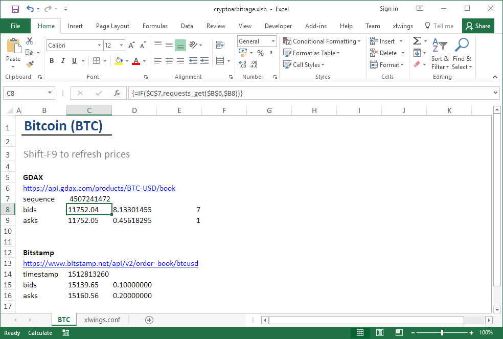

# Cryptoarbitrage.xlsb

Cryptoarbitrage.xlsb is an Excel workbook with an [xlwings](https://github.com/ZoomerAnalytics/xlwings) powered Python backend to detect arbitrage opportunities in the cryptocurrency markets.

The cryptoarbitrage.xlsb workbook is version-controlled via [xltrail](https://demo.xltrail.com/#/workbook/github.com%2FZoomerAnalytics%2Fcryptoarbitrage.git%2Fcryptoarbitrage.xlsm/)




# Requirements
- Windows
- Microsoft Excel
- Python 3.6

# Installation

## 1. Python dependencies
The easiest way to install the Python dependencies is via pip. We strongly recommend creating a virtual environment

 ```bash
python -m venv cryptoarbitrage
activate cryptoarbitrage
pip install -r requirements.txt
```

or conda

 ```bash
conda env create -f requirements.yml 
```

## 2. xlwings Addin
 ```bash
xlwings addin install
```

## 3. Configure Workbook
- Open cryptoarbitrage.xlsb
- When using a virtual environment, enter the path to Python your executable in sheet xlwings.conf, cell B1 (Interpreter). For example, replace pythonw with ```C:\Users\Bjoern\Miniconda3\envs\cryptoarbitrage\pythonw```. When using conda, you can retrieve a list of your environments with their respective paths via ```conda info --envs```. The Python interpreter would be ```<conda-env-path>\pythonw```.
- In the xlwings Excel Ribbon menu, click Restart UDF Server
- You are now set-up: Shift F9 to refresh prices from source